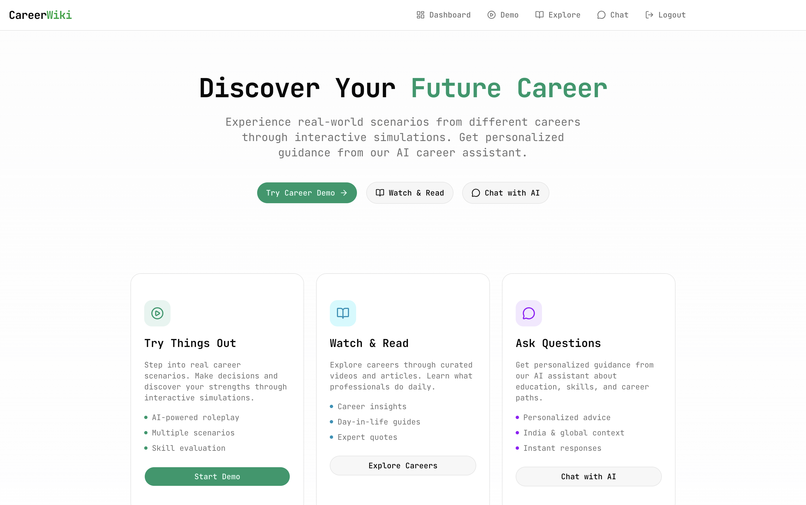

# CareerWiki

> **[Live Demo URL](https://csi-gemini-hackday.vercel.app/)**

CareerWiki is an AI-powered interactive platform designed to help students and professionals explore career paths through immersive simulations, personalized guidance, and dynamic activity tracking. 

Built as a hackathon project for **CSI Gemini Hackdays**.

## 🚀 Key Features

- **Interactive Career Simulations:** Step into the shoes of a Doctor, Software Engineer, Lawyer, and more. Experience real-world scenarios with real-time AI-streamed narration and feedback.
- **AI Career Consultant:** A personalized chatbot trained to provide actionable advice on education, skills, and career growth tailored to your profile.
- **Dynamic Dashboard:** Track your progress, maintain activity streaks, and get personalized career recommendations based on your interests.
- **Personalized Onboarding:** A smart onboarding wizard that understands your background and goals to curate your experience.

## 🛠️ Tech Stack

- **Framework:** Next.js 16 (App Router)
- **AI Engine:** Google Gemini API (2.5 / 3 Flash)
- **Database:** MongoDB with Mongoose
- **Styling:** Tailwind CSS & shadcn/ui
- **Authentication:** JWT-based secure authentication
- **UI Components:** Radix UI primitives

**Contributors:** Arpit Mishra, Ayan Mani Tripathi, Manik Prakash